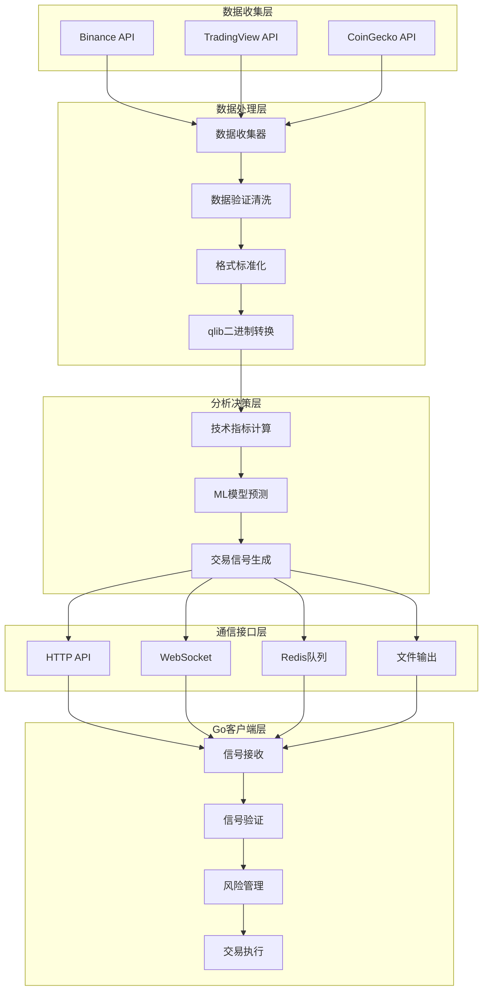

# 加密货币交易分析系统架构文档

本文档详细描述了qlib加密货币交易分析系统的整体架构设计和核心实现。

## 🏗️ 系统整体架构

### 分层架构设计

```
┌─────────────────────────────────────────────────────────────────┐
│                      🤖 Go客户端层                              │
│  ┌──────────────────┐ ┌──────────────────┐ ┌──────────────────┐ │
│  │ 信号接收与解析    │ │ 多因子信号验证    │ │ 风险管理决策      │ │
│  └──────────────────┘ └──────────────────┘ └──────────────────┘ │
└─────────────────────────────────────────────────────────────────┘
                                    ▲
┌─────────────────────────────────────────────────────────────────┐
│                      🔗 通信接口层                              │
│  ┌──────────────────┐ ┌──────────────────┐ ┌──────────────────┐ │
│  │ HTTP RESTful API │ │ WebSocket实时     │ │ Redis消息队列     │ │
│  │ go_communication │ │ 双向通信          │ │ 文件输出          │ │
│  └──────────────────┘ └──────────────────┘ └──────────────────┘ │
└─────────────────────────────────────────────────────────────────┘
                                    ▲
┌─────────────────────────────────────────────────────────────────┐
│                      🧠 分析决策层                              │
│  ┌──────────────────┐ ┌──────────────────┐ ┌──────────────────┐ │
│  │ 技术指标计算      │ │ 机器学习预测      │ │ 交易信号生成      │ │
│  │ crypto_realtime_ │ │ qlib ML模型       │ │ 多因子综合判断    │ │
│  │ analyzer.py      │ │ 集成              │ │                  │ │
│  └──────────────────┘ └──────────────────┘ └──────────────────┘ │
└─────────────────────────────────────────────────────────────────┘
                                    ▲
┌─────────────────────────────────────────────────────────────────┐
│                      🔄 数据处理层                              │
│  ┌──────────────────┐ ┌──────────────────┐ ┌──────────────────┐ │
│  │ 数据收集器        │ │ 数据标准化        │ │ qlib格式转换      │ │
│  │ *_collector.py   │ │ BaseNormalize    │ │ *_dump_bin.py    │ │
│  └──────────────────┘ └──────────────────┘ └──────────────────┘ │
└─────────────────────────────────────────────────────────────────┘
                                    ▲
┌─────────────────────────────────────────────────────────────────┐
│                      📊 数据收集层                              │
│  ┌──────────────────┐ ┌──────────────────┐ ┌──────────────────┐ │
│  │ Binance API      │ │ TradingView API  │ │ CoinGecko API    │ │
│  │ (推荐，免费)      │ │ (付费，多交易所)  │ │ (免费，仅价格)    │ │
│  └──────────────────┘ └──────────────────┘ └──────────────────┘ │
└─────────────────────────────────────────────────────────────────┘
```

## 🎯 三种数据源方案对比

### 1. Binance API方案 (推荐)

**核心文件**:
- `binance_collector.py` - 数据收集器
- `binance_dump_bin.py` - 数据转换工具  
- `binance_analyzer_starter.py` - 系统启动器
- `binance_go_client_example.go` - Go客户端

**架构特点**:
```python
# 核心类结构
class BinanceCryptoCollector(BaseCollector):
    BASE_URL = "https://api.binance.com"
    INTERVAL_MAPPING = {
        "1m": "1m", "5m": "5m", "15m": "15m",
        "1h": "1h", "4h": "4h", "1d": "1d", "1w": "1w"
    }
```

**优势**:
- ✅ 完全免费，无需认证
- ✅ 真实交易数据，毫秒级延迟
- ✅ 完整OHLC支持
- ✅ 支持7种时间间隔
- ✅ 1200次/分钟请求限制

### 2. TradingView方案

**核心文件**:
- `tradingview_collector.py` - 数据收集器
- `tradingview_dump_bin.py` - 数据转换工具
- `start_crypto_analyzer.py` - 系统启动器

**架构特点**:
```python
# 核心类结构
class TradingViewCryptoCollector(BaseCollector):
    INTERVAL_MAPPING = {
        "1d": "1D", "1h": "1H", "4h": "4H",
        "15m": "15", "5m": "5", "1m": "1"
    }
    
    def _authenticate(self) -> Optional[CookieJar]:
        # 需要Pro账户认证
```

**优势与限制**:
- ✅ 多交易所聚合数据
- ✅ 标准化处理
- ❌ 需要$14.95/月Pro账户
- ❌ 几分钟延迟

### 3. CoinGecko方案 (原有)

**核心文件**:
- `collector.py` - 基础数据收集器

**限制**:
- ❌ 仅价格、成交量、市值数据
- ❌ 无OHLC支持
- ❌ 不支持策略回测
- ✅ 完全免费

## 🔄 数据流向和处理流程

### 完整数据流水线



### 关键处理步骤

1. **数据收集阶段**
   ```python
   # 1. API调用获取原始数据
   raw_data = collector.get_data_from_remote(symbol, interval, start, end)
   
   # 2. 数据验证和清洗
   validated_data = collector._validate_ohlc_data(raw_data)
   
   # 3. 转换为DataFrame
   df = collector.convert_klines_to_dataframe(validated_data)
   ```

2. **数据转换阶段**
   ```python
   # 1. 读取CSV数据
   df = dumper._get_source_data(csv_file)
   
   # 2. OHLC逻辑验证
   df = dumper._validate_ohlc_data(df)
   
   # 3. 转换为qlib格式
   dumper._dump_bin(df, file_path, symbol)
   ```

3. **实时分析阶段**
   ```python
   # 1. 生成技术指标
   indicators = analyzer._calculate_indicators(data)
   
   # 2. ML模型预测
   prediction = analyzer._generate_ml_signals(data)
   
   # 3. 综合生成信号
   signal = analyzer._generate_recommendation(indicators, prediction)
   ```

## 🔗 组件间通信协议

### HTTP RESTful API

**基础端点**:
```
GET  /health              - 系统健康检查
GET  /signals/latest      - 获取最新信号
GET  /signals?symbols=... - 获取指定符号信号
POST /analyze             - 触发即时分析
GET  /symbols             - 获取监控交易对
```

**信号数据格式**:
```json
{
    "BTCUSDT": {
        "timestamp": "2024-01-01T12:00:00",
        "symbol": "BTCUSDT",
        "price": 45000.0,
        "volume": 1000000.0,
        "recommendation": "BUY",
        "confidence": 0.85,
        "technical_signals": {
            "rsi": 35.5,
            "macd_line": 100.5,
            "ma_5": 44800.0
        },
        "ml_prediction": {
            "prediction": 0.15,
            "confidence": 0.75
        }
    }
}
```

### WebSocket实时通信

**连接**: `ws://localhost:8765`

**消息格式**:
```json
// 订阅信号
{
    "action": "subscribe",
    "symbols": ["BTCUSDT", "ETHUSDT"]
}

// 信号推送
{
    "action": "signal_update",
    "timestamp": "2024-01-01T12:00:00",
    "data": { /* 信号数据 */ }
}
```

### Redis消息队列

**频道**: `crypto_trading_signals`

**Python订阅示例**:
```python
import redis
r = redis.Redis()
pubsub = r.pubsub()
pubsub.subscribe('crypto_trading_signals')

for message in pubsub.listen():
    if message['type'] == 'message':
        signal = json.loads(message['data'])
```

## 🤖 Go客户端架构

### 核心结构设计

```go
// 主客户端结构
type BinanceQlibClient struct {
    BaseURL         string                    // API基础URL
    Client          *http.Client             // HTTP客户端
    Config          TradingConfig            // 交易配置
    OpenPositions   map[string]*Position     // 开仓记录
    TradingHistory  []Position               // 交易历史
}

// 交易配置
type TradingConfig struct {
    MinConfidence     float64    // 最小置信度阈值
    MaxPositions      int        // 最大仓位数
    StopLossPercent   float64    // 止损百分比
    TakeProfitPercent float64    // 止盈百分比
    WatchSymbols      []string   // 监控交易对
    TradingEnabled    bool       // 实盘交易开关
}

// 仓位信息
type Position struct {
    Symbol         string    // 交易对
    Side           string    // 多空方向
    Size           float64   // 仓位大小
    EntryPrice     float64   // 入场价格
    CurrentPrice   float64   // 当前价格
    PnL            float64   // 盈亏
    StopLoss       float64   // 止损价
    TakeProfit     float64   // 止盈价
}
```

### 风险管理机制

```go
// 信号质量验证
func (c *BinanceQlibClient) AnalyzeSignal(signal BinanceTradingSignal) (bool, string) {
    score := 0
    
    // RSI验证
    if rsi < 30 && signal.Recommendation == "BUY" {
        score += 2
    }
    
    // 移动平均验证
    if priceAboveMA && signal.Recommendation == "BUY" {
        score += 1
    }
    
    // 置信度检查
    if signal.Confidence >= c.Config.MinConfidence {
        score += 2
    }
    
    return score >= 3, reasons
}

// 仓位风险管理
func (c *BinanceQlibClient) UpdatePositions(signals map[string]BinanceTradingSignal) {
    for symbol, position := range c.OpenPositions {
        if signal, exists := signals[symbol]; exists {
            // 更新当前价格
            position.CurrentPrice = signal.Price
            
            // 检查止损
            if signal.Price <= position.StopLoss {
                c.ExecuteSellOrder(symbol, signal)
            }
            
            // 检查止盈
            if signal.Price >= position.TakeProfit {
                c.ExecuteSellOrder(symbol, signal)  
            }
        }
    }
}
```

## 🚀 部署和扩展

### 容器化部署

```dockerfile
# Dockerfile示例
FROM python:3.9-slim

WORKDIR /app
COPY requirements_binance.txt .
RUN pip install -r requirements_binance.txt

COPY . .
EXPOSE 8080 8765

CMD ["python", "binance_analyzer_starter.py", "full"]
```

### 水平扩展架构

```
┌─────────────────┐    ┌─────────────────┐    ┌─────────────────┐
│ 数据收集器实例1  │    │ 数据收集器实例2  │    │ 数据收集器实例N  │
└─────────────────┘    └─────────────────┘    └─────────────────┘
          │                       │                       │
          └───────────────────────┼───────────────────────┘
                                  │
          ┌─────────────────────────────────────────────────────┐
          │                 Redis集群                          │
          │           (消息队列 + 数据缓存)                    │
          └─────────────────────────────────────────────────────┘
                                  │
          ┌─────────────────────────────────────────────────────┐
          │                负载均衡器                          │
          │            (API请求分发)                          │
          └─────────────────────────────────────────────────────┘
                                  │
┌─────────────────┐    ┌─────────────────┐    ┌─────────────────┐
│ Go客户端实例1   │    │ Go客户端实例2   │    │ Go客户端实例N   │
└─────────────────┘    └─────────────────┘    └─────────────────┘
```

### 监控和日志

```python
# 集成监控
from loguru import logger
import psutil

# 系统资源监控
def monitor_system_resources():
    cpu_percent = psutil.cpu_percent()
    memory_percent = psutil.virtual_memory().percent
    disk_percent = psutil.disk_usage('/').percent
    
    logger.info(f"系统资源: CPU {cpu_percent}%, 内存 {memory_percent}%, 磁盘 {disk_percent}%")

# 交易性能监控
def monitor_trading_performance():
    total_pnl = sum(pos.PnL for pos in trading_history)
    win_rate = len([p for p in trading_history if p.PnL > 0]) / len(trading_history)
    
    logger.info(f"交易统计: 总收益 ${total_pnl:.2f}, 胜率 {win_rate:.1%}")
```

## 📝 开发指南

### 添加新数据源

```python
# 1. 继承BaseCollector
class NewExchangeCollector(BaseCollector):
    def __init__(self, ...):
        super().__init__(...)
        
    def get_data_from_remote(self, symbol, interval, start, end):
        # 实现数据获取逻辑
        pass

# 2. 实现对应的Normalize类
class NewExchangeNormalize(BaseNormalize):
    def normalize(self, df):
        # 实现数据标准化逻辑
        pass

# 3. 创建对应的DumpBin类
class NewExchangeDumpBin(DumpDataBase):
    def dump_all(self):
        # 实现数据转换逻辑
        pass
```

### 添加新技术指标

```python
# 在CryptoRealtimeAnalyzer中添加
def _calculate_custom_indicator(self, data: pd.DataFrame) -> float:
    """自定义技术指标计算"""
    # 实现指标逻辑
    return indicator_value

# 注册到信号生成流程
def _calculate_indicators(self, data: pd.DataFrame) -> Dict:
    indicators = {
        # 现有指标...
        'custom_indicator': self._calculate_custom_indicator(data)
    }
    return indicators
```

### 扩展Go客户端功能

```go
// 添加新的交易策略
func (c *BinanceQlibClient) CustomTradingStrategy(signal BinanceTradingSignal) (bool, string) {
    // 实现自定义策略逻辑
    return shouldTrade, reason
}

// 添加新的风险管理机制  
func (c *BinanceQlibClient) AdvancedRiskManagement(position *Position) {
    // 实现高级风险管理逻辑
}
```

这个架构文档为开发者提供了完整的系统理解和扩展指南，便于后续的维护和功能增强。