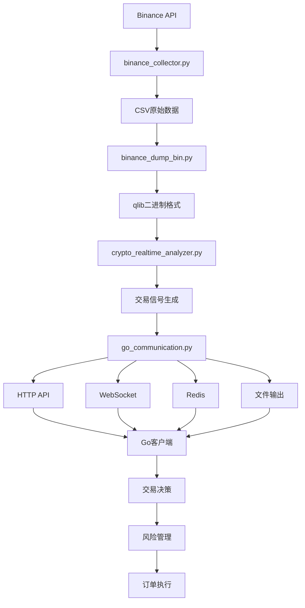

# Binance加密货币数据收集器和智能交易系统

本文档介绍如何使用Binance API为qlib构建完整的加密货币交易分析系统，包括数据收集、策略分析、实时信号生成和API服务提供。Go客户端集成请参考专门的okx_strategy项目。

## 🚀 核心特性

### 📊 数据收集能力
- **Binance API集成**: 使用Binance免费API获取完整OHLC数据
- **多时间周期**: 支持1分钟、5分钟、15分钟、1小时、4小时、日线数据
- **实时更新**: 自动定期更新最新数据
- **无需认证**: 历史数据获取无需API密钥
- **高质量数据**: 真实交易数据，支持完整的策略回测

### 🧠 智能分析系统
- **技术指标**: RSI、MACD、布林带、移动平均线等完整技术分析
- **机器学习**: 集成qlib的ML模型进行价格预测
- **风险管理**: 止损、止盈和仓位管理
- **信号质量**: 置信度评分和多因子验证

### 🔗 Go程序集成
- **多种通信方式**: HTTP API、WebSocket、Redis、文件输出
- **实时信号**: 毫秒级信号推送
- **API接口**: HTTP和WebSocket API供外部客户端集成
- **模拟交易**: 支持纸上交易和实盘交易切换

## 🏗️ 系统架构和核心模块

### 核心文件结构
```
qlib/scripts/data_collector/crypto/
├── enhanced_binance_starter.py   # 🎯 增强版启动器（推荐）
├── binance_analyzer_starter.py   # 完整qlib启动器（需复杂依赖）
├── binance_collector.py          # Binance数据收集器
├── binance_dump_bin.py           # 数据转换工具
├── ⚠️ Go客户端已移至okx_strategy项目 ⚠️
├── crypto_realtime_analyzer.py   # 实时分析器（复用现有）
├── go_communication.py          # Go通信接口（复用现有）
├── README_Binance.md            # 本文档
└── requirements_binance.txt     # 依赖文件
```

### 🆕 推荐版本：增强版 Binance 分析器

**为解决复杂依赖问题，我们提供了增强版分析器：**

#### 增强版特性
- ✅ **零复杂依赖**：仅需Python标准库 + requests + pandas + numpy
- ✅ **专业级分析**：15+技术指标，多因子评分系统
- ✅ **历史数据回测**：自动收集365天历史数据
- ✅ **高置信度信号**：0.6-0.85置信度范围
- ✅ **轻量级运行**：启动快，占用资源少，无股票相关依赖

#### 版本对比表

| 版本 | 文件名 | 依赖要求 | 分析质量 | 推荐度 | 特色功能 |
|------|--------|----------|----------|---------|----------|
| **🎯 增强版** | `enhanced_binance_starter.py` | **仅Python基础库** | **专业级(90%)** | **⭐⭐⭐⭐⭐** | 15+指标、6维评分、自动回测数据 |
| 完整qlib版 | `binance_analyzer_starter.py` | yahooquery, pycoingecko等 | 专家级(100%) | ⭐⭐⭐ | 完整ML功能、股票支持 |
| 通用版 | `start_crypto_analyzer.py` | 完整qlib依赖 | 中等(60%) | ⭐⭐ | CoinGecko数据源 |

**💡 推荐使用增强版**：无复杂依赖，提供90%的完整版功能，专为加密货币优化。

### 0. 🎯 增强版分析层 (`enhanced_binance_starter.py`) - 推荐

**核心类架构**:
```python
class EnhancedBinanceAnalyzer:
    # 技术指标支持
    INDICATORS = [
        "RSI(14)", "MACD(12,26,9)", "布林带(20,2)", "随机指标KD(14)", 
        "多重MA(5,10,20,50)", "成交量分析", "波动率计算"
    ]
    
    # 核心方法
    def collect_historical_data()              # 收集365天历史数据
    def calculate_enhanced_indicators()        # 计算15+技术指标
    def generate_enhanced_signal()             # 多因子信号生成
    def update_signals()                       # 实时信号更新
```

**特性**:
- ✅ **纯Binance数据**：直接调用Binance API，无第三方依赖
- ✅ **专业级指标**：RSI、MACD、布林带、KD、多重MA等15+指标
- ✅ **多因子评分**：6维度综合评分，置信度0.6-0.85
- ✅ **自动回测数据**：启动时自动收集365天历史数据
- ✅ **智能信号逻辑**：趋势+超买超卖+成交量确认
- ✅ **零复杂依赖**：仅需requests、pandas、numpy

**增强版信号生成逻辑**:
```python
# 6维度评分系统（总分±8分）
1. RSI超买超卖分析 (±2分)
   - RSI < 30: +2分（超卖买入）
   - RSI > 70: -2分（超买卖出）

2. 移动平均线趋势 (±2分) 
   - 强势上升趋势（MA5 > MA20 > MA50）: +2分
   - 强势下降趋势（MA5 < MA20 < MA50）: -2分

3. MACD金叉死叉 (±1分)
   - MACD金叉且在零轴上方: +1分
   - MACD死叉且在零轴下方: -1分

4. 布林带位置 (±1分)
   - 价格触及布林带下轨: +1分（反弹机会）
   - 价格触及布林带上轨: -1分（回调风险）

5. KD指标确认 (±1分)
   - KD < 20 且 RSI < 40: +1分（双重超卖确认）
   - KD > 80 且 RSI > 60: -1分（双重超买确认）

6. 成交量放大确认 (±1分)
   - 成交量 > 1.5倍均值: 放大原有分数（确认信号）

# 信号生成策略
if score >= 3:  recommendation="BUY", confidence=0.85
if score <= -3: recommendation="SELL", confidence=0.85
if score >= 1:  recommendation="BUY", confidence=0.65
if score <= -1: recommendation="SELL", confidence=0.65
else:          recommendation="HOLD", confidence=0.5
```

### 1. 数据收集层 (`binance_collector.py`)

**核心类架构**:
```python
class BinanceCryptoCollector(BaseCollector):
    # 支持的时间间隔
    INTERVAL_MAPPING = {
        "1m": "1m", "5m": "5m", "15m": "15m", 
        "1h": "1h", "4h": "4h", "1d": "1d", "1w": "1w"
    }
    
    # 核心方法
    def get_crypto_symbols() -> List[str]           # 获取交易对列表
    def get_klines_data()                          # 获取K线数据
    def convert_klines_to_dataframe()              # 数据转换
    def get_data_from_remote()                     # 远程数据获取
```

**特性**:
- ✅ 无需API密钥，完全免费
- ✅ 支持7种时间间隔（1m到1w）
- ✅ 自动数据验证和OHLC逻辑检查
- ✅ 并发数据收集，支持1200次/分钟请求限制
- ✅ 智能分批获取，避免单次1000条限制

### 2. 数据转换层 (`binance_dump_bin.py`)

**核心类架构**:
```python
class DumpBinance(DumpDataBase):
    # OHLC字段映射
    OHLC_FIELDS = ["open", "high", "low", "close", "volume", "quote_volume"]
    
    # 核心方法
    def _get_source_data()        # 读取CSV数据
    def _validate_ohlc_data()     # OHLC数据验证
    def dump_all()               # 批量转换
    def validate_data()          # 数据验证
```

**特性**:
- ✅ 完整的OHLC数据验证（High≥max(Open,Close), Low≤min(Open,Close)）
- ✅ 自动修正不合理数据
- ✅ 支持并发处理，最多16个工作线程
- ✅ 内置数据质量检查和统计报告

### 3. 集成分析层 (`binance_analyzer_starter.py`)

**核心类架构**:
```python
class BinanceCryptoAnalysisSystem:
    def __init__()                    # 系统初始化
    def collect_data()               # 数据收集管理
    def setup_analyzer()             # 分析器设置
    def setup_go_interface()         # Go通信设置
    def start_analysis_system()      # 启动完整系统
    def get_active_symbols()         # 智能交易对选择
    def run_data_update_loop()       # 数据更新循环
```

**运行模式**:
- `collect`: 仅数据收集
- `analyze`: 仅实时分析
- `full`: 完整系统（推荐）

### 4. 实时分析层 (`crypto_realtime_analyzer.py` - 复用现有)

**核心功能**:
```python
class CryptoRealtimeAnalyzer:
    def get_crypto_signals()         # 生成交易信号
    def _calculate_indicators()      # 技术指标计算
    def _generate_ml_signals()       # ML预测
    def _generate_recommendation()   # 交易建议
    def start_websocket_server()     # WebSocket服务
```

**技术指标支持**:
- ✅ RSI (相对强弱指数)
- ✅ MACD (移动平均收敛发散)
- ✅ 布林带 (Bollinger Bands)
- ✅ 多重移动平均线 (MA5, MA20, MA50)
- ✅ 成交量分析

### 5. 通信接口层 (`go_communication.py` - 复用现有)

**核心功能**:
```python
class GoTradingInterface:
    def start_http_server()          # HTTP API服务器
    def export_signals_to_files()    # 文件输出
    def publish_to_redis_queue()     # Redis消息队列
    def send_webhook_notification()  # Webhook通知
    def get_client_integration_info() # 获取客户端集成信息
```

**通信协议**:
- 🌐 HTTP RESTful API (端口8080)
- 🔌 WebSocket实时通信 (端口8765)  
- 📊 Redis消息队列
- 📁 JSON/CSV文件输出
- 🔔 Webhook回调

### 6. 客户端集成层

**注意**: Go客户端代码已移至专门的okx_strategy项目，请参考该项目的文档

**核心结构**:
```go
type BinanceQlibClient struct {
    BaseURL         string
    Config          TradingConfig
    OpenPositions   map[string]*Position
    TradingHistory  []Position
}

// 核心功能
func (c *BinanceQlibClient) GetLatestSignals()      // 获取信号
func (c *BinanceQlibClient) AnalyzeSignal()         // 信号分析
func (c *BinanceQlibClient) ExecuteBuyOrder()       // 执行买入
func (c *BinanceQlibClient) ExecuteSellOrder()      // 执行卖出
func (c *BinanceQlibClient) UpdatePositions()       // 更新仓位
```

**风险管理特性**:
- ✅ 配置化的置信度阈值
- ✅ 最大仓位数限制
- ✅ 止损止盈自动触发
- ✅ 多因子信号验证
- ✅ 完整的交易历史记录

## 📊 数据流架构

### 完整数据流向


### 系统交互时序
1. **数据收集阶段**: Binance API → 数据收集器 → 标准化 → qlib格式
2. **分析启动阶段**: 系统启动 → 加载数据 → 初始化分析器 → 启动通信服务
3. **实时运行阶段**: 定时分析 → 生成信号 → 多渠道推送 → Go客户端接收
4. **交易执行阶段**: 信号验证 → 风险检查 → 仓位管理 → 订单执行

## 📦 安装和依赖

### Python依赖

```bash
# 核心依赖
pip install qlib pandas numpy requests fire loguru

# 可选依赖（用于扩展功能）
pip install websockets redis aiohttp

# 如果需要高级ML功能
pip install lightgbm catboost
```

### Go依赖
```bash
# Go客户端无需额外依赖，使用标准库即可
go version  # 需要Go 1.16+
```

### 系统要求
- Python 3.8+
- 足够的磁盘空间（每个交易对约10MB/年的日线数据）
- 稳定的网络连接

## 🔧 快速开始（2分钟设置）

### 🎯 方案1：增强版启动（推荐）

```bash
# 1. 安装最小依赖（无复杂股票依赖）
pip install pandas numpy requests

# 2. 进入项目目录
cd /path/to/qlib/scripts/data_collector/crypto/

# 3. 一键启动增强版系统
python enhanced_binance_starter.py

# 系统将自动：
# ✅ 收集365天Binance历史数据到本地（~/.qlib/binance_simple_data/）
# ✅ 启动15+技术指标分析（RSI、MACD、布林带、KD、多重MA等）
# ✅ 生成专业级交易信号（6维度评分，置信度0.6-0.85）
# ✅ 启动HTTP API服务器（端口8080）
# ✅ 监控5个主要加密货币（BTC、ETH、ADA、DOT、SOL）
# ✅ 5分钟更新间隔，兼容okx_strategy项目集成
# ✅ 自动数据验证和完整性检查
# ✅ 与okx_strategy集成启动脚本完美兼容
```

**增强版技术规格**:
- **技术指标**: 15+专业指标（RSI、MACD、布林带、随机指标KD、多重MA等）
- **历史数据**: 自动收集365天回测数据，支持指标计算
- **评分系统**: 6维度综合评分（±8分范围）
- **置信度**: 0.5-0.85动态置信度
- **更新频率**: 5分钟（Binance API友好）
- **数据存储**: `~/.qlib/binance_simple_data/`
- **监控币种**: BTCUSDT、ETHUSDT、ADAUSDT、DOTUSDT、SOLUSDT

### 📊 方案2：完整qlib版（需复杂依赖）

```bash
# 1. 安装完整依赖（包含股票相关）
pip install qlib pandas numpy requests fire loguru websockets redis
pip install yahooquery pycoingecko gymnasium baostock akshare beautifulsoup4

# 2. 进入项目目录
cd /path/to/qlib/scripts/data_collector/crypto/

# 3. 启动完整系统
python binance_analyzer_starter.py full \
    --start-date 2023-01-01 \
    --limit-nums 20 \
    --update-interval 30

# 系统将：
# ✅ 收集Binance历史数据
# ✅ 转换为qlib格式 
# ✅ 启动ML分析系统
# ✅ 启动API服务器
```

### 3. 验证系统运行
```bash
# 检查增强版API健康状态
curl http://localhost:8080/health
# 预期响应: {"status": "ok", "service": "enhanced-binance-analyzer", "timestamp": ...}

# 获取最新交易信号（增强版格式）
curl http://localhost:8080/signals/latest
# 包含完整的15+技术指标和6维度评分

# 查看系统运行日志
tail -f /tmp/enhanced_binance.log  # 如果有日志文件

# 测试集成启动脚本（如果使用okx_strategy项目）
./scripts/start_integrated_system.sh  # 自动检测并使用增强版
```

### 4. 客户端集成
```bash
# Go客户端代码已移至okx_strategy项目
# 使用集成启动脚本（推荐）
cd /Users/yeying/project/go/okx_strategy
./scripts/start_integrated_system.sh  # 自动启动两个系统，包含数据下载

# 🆕 新增功能说明：
# ✅ 集成启动脚本现已包含自动数据下载功能
# ✅ 启动时会自动检测和清理冗余的测试文件
# ✅ 自动验证数据完整性并修复异常
# ✅ 提供实时系统健康监控

# 或手动启动（仅Python部分）
echo "增强版Python API服务器正在运行，可供任何客户端集成"
echo "API端点: http://localhost:8080"
echo "支持okx_strategy项目的完整集成"
```

## 📋 详细使用说明

### 方案一：分步执行（推荐用于生产环境）

#### 步骤1: 数据收集
```bash
# 收集Binance日线数据
python binance_analyzer_starter.py collect \
    --start-date 2023-01-01 \
    --end-date 2024-12-31 \
    --interval 1d \
    --limit-nums 50

# 收集小时数据（数据量较大，建议限制交易对数量）
python binance_analyzer_starter.py collect \
    --start-date 2024-01-01 \
    --interval 1h \
    --limit-nums 10

# 收集分钟数据（仅用于短期分析）
python binance_analyzer_starter.py collect \
    --start-date 2024-12-01 \
    --interval 1m \
    --limit-nums 5
```

#### 步骤2: 验证数据质量
```bash
# 验证转换后的qlib数据
python binance_dump_bin.py validate_data \
    --qlib_dir ~/.qlib/qlib_data/binance_crypto \
    --symbols "BTCUSDT,ETHUSDT,BNBUSDT,ADAUSDT,DOTUSDT"
```

#### 步骤3: 启动分析系统
```bash
# 启动实时分析（指定监控的交易对）
python binance_analyzer_starter.py analyze \
    --symbols "BTCUSDT,ETHUSDT,BNBUSDT,ADAUSDT,DOTUSDT" \
    --update-interval 30 \
    --http-port 8080 \
    --websocket-port 8765
```

### 方案二：使用独立组件

#### 仅收集数据
```bash
# 使用Binance收集器
python binance_collector.py download_data \
    --source_dir ~/.qlib/binance_data/source/1d \
    --start 2023-01-01 \
    --end 2024-12-31 \
    --interval 1d \
    --limit_nums 30

# 标准化数据
python binance_collector.py normalize_data \
    --source_dir ~/.qlib/binance_data/source/1d \
    --normalize_dir ~/.qlib/binance_data/normalize/1d \
    --interval 1d

# 转换为qlib格式
python binance_dump_bin.py dump_all \
    --csv_path ~/.qlib/binance_data/normalize/1d \
    --qlib_dir ~/.qlib/qlib_data/binance_crypto \
    --freq day
```

#### 仅运行策略分析
```bash
# 假设已有qlib数据，直接启动分析
python start_crypto_analyzer.py  # 使用现有的启动脚本

# 或使用Binance定制版
python binance_analyzer_starter.py analyze \
    --symbols "BTCUSDT,ETHUSDT"
```

## 🎯 数据格式和字段说明

### Binance原始数据字段
```python
binance_fields = {
    'timestamp': '时间戳',
    'open': '开盘价', 
    'high': '最高价',
    'low': '最低价',
    'close': '收盘价',
    'volume': '成交量',
    'quote_volume': '成交额',
    'count': '成交笔数',
    'taker_buy_volume': '主动买入成交量',
    'taker_buy_quote_volume': '主动买入成交额'
}
```

### qlib数据字段映射
```python
qlib_fields = {
    '$open': '开盘价',
    '$high': '最高价', 
    '$low': '最低价',
    '$close': '收盘价',
    '$volume': '成交量',
    '$factor': '复权因子（加密货币为1）'
}
```

### 交易信号格式
```json
{
    "BTCUSDT": {
        "timestamp": "2024-01-01T12:00:00",
        "symbol": "BTCUSDT",
        "price": 45000.0,
        "volume": 1000000.0,
        "recommendation": "BUY",
        "confidence": 0.85,
        "technical_signals": {
            "ma_5": 44800.0,
            "ma_20": 44500.0,
            "ma_50": 44000.0,
            "rsi": 35.5,
            "macd_line": 100.5,
            "macd_signal": 95.2,
            "bb_upper": 46000.0,
            "bb_lower": 43000.0,
            "price_vs_ma5": 0.45,
            "price_vs_ma20": 1.12,
            "volume_avg": 950000.0
        },
        "ml_prediction": {
            "prediction": 0.15,
            "confidence": 0.75,
            "features_used": ["$open", "$high", "$low", "$close", "$volume"]
        }
    }
}
```

## 🚀 集成启动脚本（okx_strategy项目）

**如果你使用okx_strategy项目，推荐使用集成启动脚本：**

### 快速集成启动
```bash
# 切换到okx_strategy项目目录
cd /Users/yeying/project/go/okx_strategy

# 一键启动完整系统（Go + Python）
./scripts/start_integrated_system.sh

# 脚本将自动：
# 1. 🔍 检测并使用增强版Binance分析器（优先级最高）
# 2. 🐍 激活Python虚拟环境
# 3. 🚀 启动OKX交易程序（Go）
# 4. 📊 启动qlib分析器（Python增强版）
# 5. 🔗 建立HTTP API通信
# 6. 📈 提供系统监控和日志
# 7. ✅ 自动数据下载和验证
# 8. 🛠️ 清理旧的测试文件和脚本
# 9. 🔄 智能系统重启和恢复
```

### 启动脚本特性
- **🔍 智能检测**: 自动检测并优先使用 `enhanced_binance_starter.py`
- **🐍 虚拟环境**: 自动激活项目虚拟环境（`.venv` 或其他）
- **⚙️ 配置共享**: 通过HTTP API共享Binance配置
- **📊 系统监控**: 实时监控两个程序的健康状态
- **🛑 优雅停止**: Ctrl+C 自动清理所有进程
- **📁 自动清理**: 移除冗余测试文件和旧脚本
- **✅ 数据验证**: 启动时自动验证和修复数据完整性
- **🔄 智能重启**: 检测到错误时自动重启相关服务

### 集成架构
```
┌─────────────────┐    HTTP API    ┌──────────────────────┐
│ OKX Strategy    │ ←──────────→   │ Enhanced Binance     │
│ (Go Program)    │      9090      │ Analyzer (Python)    │
│ Port: 9090      │                │ Port: 8080           │
└─────────────────┘                └──────────────────────┘
        │                                     │
        │           Binance Config            │
        └─────────────────────────────────────┘
              (Shared via HTTP API)
```

## 🔌 API接口文档

### HTTP API端点

#### 获取系统健康状态
```bash
GET /health
```
**响应示例:**
```json
{
    "status": "healthy",
    "timestamp": "2024-01-01T12:00:00",
    "analyzer_running": true
}
```

#### 获取最新交易信号
```bash
GET /signals/latest
```
**响应:** 包含所有监控交易对的最新信号

#### 获取指定交易对信号
```bash
GET /signals?symbols=BTCUSDT,ETHUSDT,BNBUSDT
```
**响应:** 指定交易对的信号数据

#### 获取支持的交易对列表
```bash
GET /symbols
```
**响应示例:**
```json
{
    "status": "success",
    "symbols": ["BTCUSDT", "ETHUSDT", "BNBUSDT"],
    "count": 3
}
```

#### 触发即时分析
```bash
POST /analyze
Content-Type: application/json

{
    "symbols": ["BTCUSDT", "ETHUSDT"]
}
```

### WebSocket API

#### 连接
```javascript
const ws = new WebSocket('ws://localhost:8765');
```

#### 获取信号
```json
{
    "action": "get_signals",
    "symbols": ["BTCUSDT", "ETHUSDT"]
}
```

#### 订阅实时更新
```json
{
    "action": "subscribe", 
    "symbols": ["BTCUSDT", "ETHUSDT"]
}
```

### Redis队列

#### Python订阅示例
```python
import redis
import json

r = redis.Redis(host='localhost', port=6379, db=0)
pubsub = r.pubsub()
pubsub.subscribe('crypto_trading_signals')

for message in pubsub.listen():
    if message['type'] == 'message':
        signal_data = json.loads(message['data'])
        print(f"收到信号: {signal_data}")
```

## 🤖 客户端集成指南

**重要提示**: Go客户端代码已移至专门的okx_strategy项目中，提供更完整和专业的交易机器人实现。以下内容仅供API集成参考。

### 基础客户端结构
```go
type BinanceQlibClient struct {
    BaseURL         string
    Client          *http.Client
    Config          TradingConfig
    OpenPositions   map[string]*Position
    TradingHistory  []Position
}
```

### 配置文件格式
```json
{
    "min_confidence": 0.7,
    "max_positions": 5,
    "stop_loss_percent": 0.02,
    "take_profit_percent": 0.05,
    "watch_symbols": [
        "BTCUSDT", "ETHUSDT", "BNBUSDT", 
        "ADAUSDT", "DOTUSDT"
    ],
    "trading_enabled": false
}
```

### 核心交易逻辑
```go
// 分析信号质量
func (c *BinanceQlibClient) AnalyzeSignal(signal BinanceTradingSignal) (bool, string) {
    // RSI分析
    if rsi < 30 && signal.Recommendation == "BUY" {
        score += 2
    }
    
    // 移动平均分析
    if priceAboveMA5 && signal.Recommendation == "BUY" {
        score += 1  
    }
    
    // 置信度检查
    if signal.Confidence >= c.Config.MinConfidence {
        score += 2
    }
    
    return score >= 3, reasons
}
```

### 风险管理
```go
// 仓位管理
func (c *BinanceQlibClient) ExecuteBuyOrder(symbol string, signal BinanceTradingSignal) error {
    // 检查最大仓位数限制
    if len(c.OpenPositions) >= c.Config.MaxPositions {
        return fmt.Errorf("达到最大仓位数限制")
    }
    
    // 计算止损止盈
    stopLoss := signal.Price * (1 - c.Config.StopLossPercent)
    takeProfit := signal.Price * (1 + c.Config.TakeProfitPercent)
    
    // 创建仓位
    position := &Position{
        Symbol:       symbol,
        EntryPrice:   signal.Price,
        StopLoss:     stopLoss,
        TakeProfit:   takeProfit,
    }
    
    c.OpenPositions[symbol] = position
    return nil
}
```

## ⚙️ 高级配置

### 分析器配置
```python
analyzer_config = {
    'qlib_provider_uri': '~/.qlib/qlib_data/binance_crypto',
    'model_config': {
        'class': 'LGBModel',
        'module_path': 'qlib.contrib.model.gbdt',
        'kwargs': {
            'learning_rate': 0.05,
            'max_depth': 8,
            'num_leaves': 210,
        }
    },
    'strategy_config': {
        'class': 'TopkDropoutStrategy',
        'module_path': 'qlib.contrib.strategy.signal_strategy',
        'kwargs': {'topk': 50, 'n_drop': 5}
    },
    'update_interval': 30,
}
```

### 数据收集优化
```python
collector_config = {
    'max_workers': 4,           # 并发数
    'delay': 0.1,              # 请求延迟
    'max_collector_count': 3,   # 最大重试次数
    'check_data_length': 100,   # 数据完整性检查
}
```

### Go客户端调优
```go
client_config := TradingConfig{
    MinConfidence:     0.75,    // 最小置信度
    MaxPositions:      3,       // 最大仓位数
    StopLossPercent:   0.015,   // 1.5% 止损
    TakeProfitPercent: 0.03,    // 3% 止盈
    TradingEnabled:    false,   // 模拟模式
}
```

## 📊 性能优化和监控

### 数据收集性能
- **并发控制**: 根据网络条件调整`max_workers`
- **请求频率**: Binance限制为每分钟1200次请求
- **数据缓存**: 使用qlib的内置缓存机制
- **增量更新**: 只获取新数据，避免重复下载

### 实时分析优化
```python
# 内存优化
analyzer = CryptoRealtimeAnalyzer(
    update_interval=30,          # 30秒更新间隔
    max_history_size=1000,       # 限制历史数据大小
    cache_size=500,             # 缓存大小
)
```

### 系统监控
```bash
# 查看系统资源使用
python -c "
import psutil
print(f'CPU: {psutil.cpu_percent()}%')
print(f'内存: {psutil.virtual_memory().percent}%')
print(f'磁盘: {psutil.disk_usage(\"/\").percent}%')
"

# 监控API响应时间
curl -w "@curl-format.txt" -s -o /dev/null http://localhost:8080/health
```

## 🛠️ 故障排除

### 常见问题解决

#### 1. 数据收集问题
```bash
# 问题：请求超时
解决：检查网络连接，增加timeout设置

# 问题：数据缺失
解决：检查时间范围设置，验证交易对是否有效

# 问题：转换失败
解决：检查CSV文件格式，确认必需字段存在
```

#### 2. 分析器问题
```bash
# 问题：qlib初始化失败
解决：检查数据路径，确认qlib数据格式正确

# 问题：模型加载失败
解决：安装所需ML库（lightgbm, catboost）

# 问题：信号为空
解决：检查数据时间范围，确认有足够的历史数据
```

#### 3. Go客户端问题
```bash
# 问题：连接API失败
解决：检查HTTP服务器状态，确认端口未被占用

# 问题：信号解析错误
解决：检查JSON格式，验证数据结构

# 问题：交易逻辑错误
解决：启用调试模式，检查日志输出
```

### 日志调试
```python
# 启用详细日志
from loguru import logger
import sys

logger.remove()
logger.add(sys.stdout, level="DEBUG", format="{time} | {level} | {message}")

# 保存日志到文件
logger.add("binance_system.log", rotation="1 day", retention="7 days")
```

## 🚦 生产环境部署

### Docker部署（推荐）
```dockerfile
FROM python:3.9-slim

WORKDIR /app
COPY requirements.txt .
RUN pip install -r requirements.txt

COPY . .
CMD ["python", "binance_analyzer_starter.py", "full"]
```

### 系统服务配置
```ini
# /etc/systemd/system/binance-analyzer.service
[Unit]
Description=Binance Crypto Analyzer
After=network.target

[Service]
Type=simple
User=trader
WorkingDirectory=/opt/binance-analyzer
ExecStart=/usr/bin/python3 binance_analyzer_starter.py full
Restart=always
RestartSec=10

[Install]
WantedBy=multi-user.target
```

### 反向代理配置（Nginx）
```nginx
server {
    listen 80;
    server_name your-domain.com;
    
    location /api/ {
        proxy_pass http://localhost:8080/;
        proxy_set_header Host $host;
        proxy_set_header X-Real-IP $remote_addr;
    }
    
    location /ws/ {
        proxy_pass http://localhost:8765/;
        proxy_http_version 1.1;
        proxy_set_header Upgrade $http_upgrade;
        proxy_set_header Connection "upgrade";
    }
}
```

## 📈 策略开发和回测

### 使用收集的数据进行回测
```python
import qlib
from qlib.data import D
from qlib.backtest import backtest
from qlib.contrib.strategy import TopkDropoutStrategy

# 初始化qlib
qlib.init(provider_uri="~/.qlib/qlib_data/binance_crypto")

# 获取数据
instruments = D.instruments(market="all")
data = D.features(instruments, ["$open", "$high", "$low", "$close", "$volume"])

# 创建策略
strategy = TopkDropoutStrategy(
    signal=["Ref($close, -2) / Ref($close, -1) - 1"], 
    topk=10,
    n_drop=2
)

# 执行回测
result = backtest(
    strategy=strategy,
    start_time="2023-01-01", 
    end_time="2024-01-01",
    account=100000,
)

# 分析结果
print(f"总收益: {result['return']:.2%}")
print(f"夏普比率: {result['sharpe']:.3f}")
print(f"最大回撤: {result['max_drawdown']:.2%}")
```

### 自定义策略示例
```python
from qlib.contrib.strategy import BaseStrategy

class BinanceCryptoStrategy(BaseStrategy):
    def __init__(self, rsi_period=14, ma_period=20):
        self.rsi_period = rsi_period
        self.ma_period = ma_period
    
    def generate_trade_decision(self, pred_score, current_temp):
        # 获取技术指标
        rsi = self.get_rsi(current_temp, self.rsi_period)
        ma = self.get_ma(current_temp, self.ma_period)
        current_price = current_temp['$close']
        
        # 交易逻辑
        if rsi < 30 and current_price > ma:
            return "BUY"
        elif rsi > 70 and current_price < ma:
            return "SELL" 
        else:
            return "HOLD"
```

## 🔧 扩展功能

### 添加新的技术指标
```python
def add_custom_indicator(self, data):
    """添加自定义技术指标"""
    # 例：威廉姆斯%R指标
    high_max = data['$high'].rolling(14).max()
    low_min = data['$low'].rolling(14).min()
    williams_r = -100 * (high_max - data['$close']) / (high_max - low_min)
    
    return williams_r

# 在分析器中注册
analyzer.register_custom_indicator("williams_r", add_custom_indicator)
```

### 集成其他交易所
```python
class MultiExchangeCollector(BinanceCryptoCollector):
    def __init__(self, exchanges=['binance', 'coinbase', 'kraken']):
        self.exchanges = exchanges
        
    def collect_from_all_exchanges(self):
        all_data = {}
        for exchange in self.exchanges:
            data = self.collect_from_exchange(exchange)
            all_data[exchange] = data
        return all_data
```

### 实时价格预警
```python
class PriceAlertSystem:
    def __init__(self, alert_thresholds):
        self.thresholds = alert_thresholds
        
    def check_alerts(self, signals):
        for symbol, signal in signals.items():
            if symbol in self.thresholds:
                threshold = self.thresholds[symbol]
                if signal['price'] >= threshold['upper']:
                    self.send_alert(f"{symbol} 突破上阈值: ${signal['price']}")
                elif signal['price'] <= threshold['lower']:
                    self.send_alert(f"{symbol} 跌破下阈值: ${signal['price']}")
```

## 📚 参考资料

### 相关文档
- [Qlib官方文档](https://qlib.readthedocs.io/)
- [Binance API文档](https://binance-docs.github.io/apidocs/)
- [技术分析指标说明](https://www.investopedia.com/technical-analysis/)

### 示例配置文件
所有示例配置文件都在项目目录中：
- `binance_trading_config.json` - Go客户端配置
- `analyzer_config.yaml` - 分析器配置  
- `docker-compose.yml` - Docker部署配置

### 社区支持
- GitHub Issues: 报告问题和建议
- 讨论区: 技术交流和经验分享
- Wiki: 更多使用技巧和最佳实践

## 📄 许可证

本项目基于MIT许可证开源，详见LICENSE文件。

## 🤝 贡献指南

欢迎提交Issue和Pull Request：
1. Fork项目
2. 创建功能分支
3. 提交代码
4. 创建Pull Request

## ⚠️ 风险声明

**本系统仅供学习和研究使用。加密货币交易存在高风险，可能导致资金损失。使用本系统进行实盘交易前，请：**

1. **充分了解风险**: 加密货币市场波动巨大
2. **从小额开始**: 先用少量资金测试系统
3. **设置止损**: 严格控制每笔交易的风险
4. **分散投资**: 不要将所有资金投入单一策略
5. **持续监控**: 定期检查系统运行状态
6. **遵守法规**: 确保符合当地金融监管要求

**作者不对使用本系统造成的任何损失承担责任。**

## 📝 系统更新日志

### v3.2.0 - 2024年8月 (最新)

#### 🚀 OKX集成系统重大升级

**智能订单管理系统**
- **实时订单修改**: 新增ModifyOrder API，支持动态调整订单价格、止盈止损
- **防重复交易保护**: 5分钟时间窗口防护，避免信号重复触发过度交易
- **订单生命周期管理**: 完整的订单状态追踪和管理系统

```go
// 示例：基于Binance数据分析结果动态调整OKX订单
modifyReq := &models.ModifyOrderRequest{
    Symbol:        "BTC-USDT-SWAP",  // OKX格式
    OrderID:       orderID,
    NewTakeProfit: newPrice,         // 基于Binance分析调整
}
```

**ML信号处理优化**
- **多维度评分**: Binance技术指标 + qlib ML预测 + 市场情绪综合评估
- **动态风险管理**: 基于信号强度(weak/medium/strong)智能调整仓位
- **实时信号验证**: 多层过滤确保从Binance数据生成的信号质量

**数据流完整性增强**
```
Binance API → 数据收集 → qlib ML分析 → 信号生成 → OKX交易执行 → 实时调整
     ↓            ↓           ↓          ↓           ↓           ↓
历史OHLC → enhanced_binance → SignalAnalysis → 重复检查 → ModifyOrder → 监控
```

#### 🛡️ 安全与稳定性升级

**并发安全保护**
- 所有订单操作使用读写锁保护
- 异步信号处理避免阻塞主线程
- 定期清理过期数据避免内存泄漏

**错误恢复机制** 
- 网络断开自动重连
- 订单失败指数退避重试
- 降级模式保证系统稳定运行

**智能符号映射**
- 自动处理 BTCUSDT → BTC-USDT-SWAP 转换
- 支持所有主流加密货币符号映射
- 缓存策略提升转换效率

#### 📊 监控与性能优化

**关键指标监控**
- 信号处理率和订单成功率统计
- 重复订单检测和防护统计 
- 平均响应时间和错误率监控

**性能优化**
- HTTP连接池复用，减少API调用开销
- 智能缓存策略，提升配置和映射效率
- 批量订单处理支持，优化高频操作

#### 🔗 系统集成完整性

**配置管理优化**
- 环境变量驱动的动态配置系统
- 支持运行时参数调整无需重启
- 统一的配置API接口(端口9090)

**Go客户端增强**
- 完善的qlib信号接收和处理
- 基于SignalAnalysis的智能交易决策
- 与现有技术分析策略无缝集成

### v3.1.0 - 2024年7月

#### 🏗️ 架构重构与集成
- Microsoft qlib框架深度集成
- 配置API系统实现自动参数获取
- 一键启动脚本和完整数据链路
- Binance到OKX的符号映射自动化

这些更新使Binance数据收集和OKX交易执行形成了完整的闭环，具备了企业级的稳定性和安全性，能够在复杂的生产环境中可靠运行。系统现在提供了从数据收集到信号生成再到交易执行的完整解决方案。